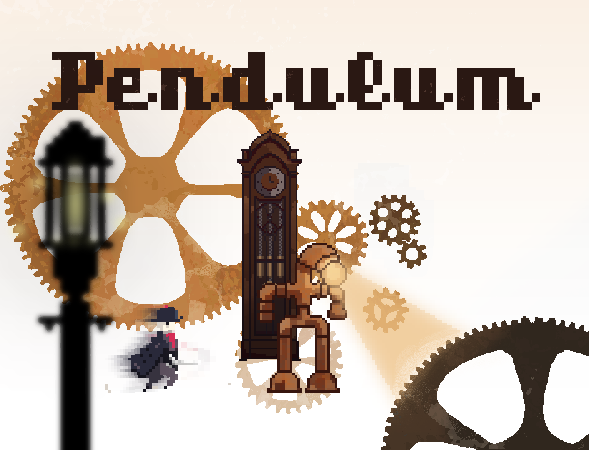

 

<em><strong>What if you could try out a different version of the present moment?
 What would you do? </strong></em>

 

Pendulum is a steampunk-inspired 2D platformer. Our hero is striving to survive in this mysterious and&nbsp;hostile place that is full of traps, puzzles&nbsp;and enemies.
Aside from being able to attack the enemies, he can use his other present version to check what is ahead. This will allow the player to "foresee" what can't be seen right ahead, along with helping him solve some puzzles.

 

<em><strong>This game&nbsp;was originally our submission to <a href="https://itch.io/jam/extra-credits-holiday-2018-game-jam" target="_blank">Extra Credits game jam 2018</a> and we decided to keep working on it post jam.</strong></em> 

 

<h2>Meet the team</h2>
<ul>
  <li>Nielisson Mendonca (<a href="https://nielisson.itch.io/" target="_blank">@nielisson</a>)&nbsp;&mdash; Pixel&nbsp;Artist</li>
  <li><a href="https://github.com/Belz" target="_blank">Jorge Baptista</a> (<a href="https://belz.itch.io/" target="_blank">@Belz</a>)&nbsp; &mdash; Programmer</li>
  <li>Naphtalene(<a href="https://naphtalene.itch.io/" target="_blank">@naphtalene</a>)&nbsp;&mdash;&nbsp;Sound Designer</li>
</ul>
 

<h2>Credits</h2>
<ul>
  <li>Font <a href="https://www.fontspace.com/konstantine-studio/rothe-demo" target="_blank">Rothe Demo</a> by <a href="https://www.fontspace.com/konstantine-studio" target="_blank">Konstantine Studio</a>.
</ul>

 

<h2>License</h2>
<ul>
  <li>Code licensed under the <a href="https://choosealicense.com/licenses/mit/" target="">MIT license</a>. For more information read our license file <a href="LICENSE">here</a>.</li>
  <li>Assets licensed under the <a href="https://creativecommons.org/licenses/by-nc/4.0/" target="_blank">Attribution-NonCommercial 4.0 International (CC BY-NC 4.0)</a>. The full license file can be found <a href="https://creativecommons.org/licenses/by-nc/4.0/legalcode" target="_blank">here</a>.
</ul>
